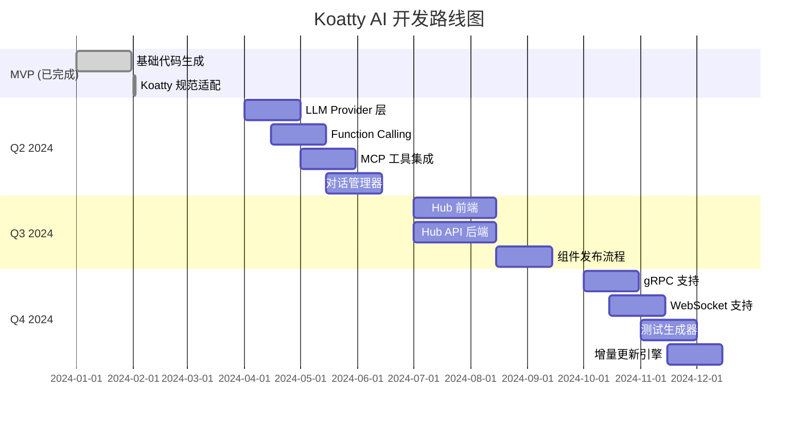

# Koatty AI - 智能脚手架工具

Koatty AI 是为 Koatty 框架设计的智能代码生成工具，通过 YAML/JSON 规范文件快速生成符合 Koatty 框架规范的 Model、DTO、Service、Controller、Middleware 和 Aspect 代码。

## ✨ 特性

- **完全符合 Koatty 框架规范**：使用 `@Service()`, `@Autowired()`, `@GetMapping` 等官方推荐的方式
- **支持多种代码生成**：Model, DTO, Service, Controller, Middleware, Aspect
- **TypeORM 集成**：自动生成实体类，支持软删除、时间戳等
- **数据验证**：使用 `koatty_validation` 生成带有验证规则的 DTO
- **权限控制**：支持基于角色的访问控制（RBAC）
- **代码质量保证**：自动运行 Prettier、ESLint 和 TypeScript 类型检查
- **Git 集成**：自动提交生成的代码

## 🔮 未来规划 - AI 驱动的智能开发

Koatty AI 正在从"配置驱动"升级为"对话驱动"的智能开发助手，以下是规划中的 AI 特性：

### 🤖 LLM 驱动的智能代码生成

> **目标**：通过自然语言对话自动生成代码，让开发像聊天一样简单

**核心能力**：

| 能力             | 描述                       | 示例                                               |
| ---------------- | -------------------------- | -------------------------------------------------- |
| **自然语言理解** | 理解用户意图，提取关键信息 | "新增一个用户控制器" → 自动生成 UserController     |
| **多轮对话细化** | 通过对话逐步明确需求       | "开发用户管理" → 询问字段、权限、API 等细节        |
| **智能推断**     | 根据上下文自动推断缺失信息 | "用户管理" → 推断需要 name、email、password 等字段 |
| **代码审查**     | 生成后自动检查代码质量     | 检查是否符合 Koatty 规范，提供优化建议             |

**交互示例**：

```bash
# 场景 1: 简单命令
$ koatty-ai chat
AI: 你好！我是 Koatty AI 助手，我可以帮你生成代码。有什么需要帮助的吗？

你: 新增一个用户控制器

AI: 我将为您创建 UserController。请确认以下信息：
    - 控制器路径: /users
    - 包含方法: list, detail, create, update, remove
    是否需要调整？

你: 路径改成 /api/users

AI: 好的，已调整。正在生成...
    ✅ 已创建 src/user/controller/UserController.ts

    是否需要同时生成对应的 Service 和 Model？

你: 是

AI: 请提供 User 模块的字段信息，或者我可以为您推荐常用字段：
    - username (string, 必填)
    - email (string, 必填, 唯一)
    - password (string, 必填)
    - status (enum: active/inactive)
    使用这些字段吗？

你: 再加一个 phone 字段

AI: 好的，已添加 phone 字段。正在生成完整模块...
    ✅ 已创建 src/user/model/UserModel.ts
    ✅ 已创建 src/user/dto/UserDto.ts
    ✅ 已创建 src/user/service/UserService.ts

    生成完成！您可以运行 `npm run dev` 启动服务测试。
```

**技术架构**：

```
┌─────────────────────────────────────────────────────────┐
│                   用户交互层                        │
│  ┌─────────────┐  ┌─────────────┐  ┌──────────┐ │
│  │   CLI 命令   │  │  Web UI     │  │  MCP API │ │
│  └─────────────┘  └─────────────┘  └──────────┘ │
└─────────────────────────────────────────────────────────┘
                         │
                         ▼
┌─────────────────────────────────────────────────────────┐
│                   LLM 编排层                        │
│  ┌─────────────────────────────────────────────────┐  │
│  │   Conversation Manager (对话管理器)            │  │
│  │   • 会话状态管理                             │  │
│  │   • 上下文维护                               │  │
│  │   • 多轮对话编排                             │  │
│  └─────────────────────────────────────────────────┘  │
└─────────────────────────────────────────────────────────┘
                         │
                         ▼
┌─────────────────────────────────────────────────────────┐
│              工具调用层 (Function Calling)         │
│  • generate_module    - 生成完整模块              │
│  • create_controller  - 创建控制器                 │
│  • analyze_project    - 分析项目结构               │
│  • validate_spec     - 验证规范                   │
└─────────────────────────────────────────────────────────┘
                         │
                         ▼
┌─────────────────────────────────────────────────────────┐
│              代码生成层 (现有)                      │
│  • Generators  • Templates  • ChangeSet           │
└─────────────────────────────────────────────────────────┘
```

### 🌐 Koatty Hub - 组件生态平台

> **目标**：建立 Koatty 框架的组件生态，让开发者能够发现、安装和分享高质量组件

**核心功能**：

| 功能     | 描述                 |
| -------- | -------------------- |
| **发现** | 浏览和搜索高质量组件 |
| **安装** | 一键安装组件到项目   |
| **贡献** | 分享自己创建的组件   |
| **评价** | 评分、评论、使用统计 |

**组件分类**：

```
Koatty Hub
├── 🏛️ 官方组件 (Official)
│   ├── koatty_core          # 核心框架
│   ├── koatty_container     # IOC 容器
│   ├── koatty_router        # 路由
│   ├── koatty_validation    # 验证
│   └── ...
│
├── 🔌 中间件 (Middleware)
│   ├── koatty-cors          # 跨域处理
│   ├── koatty-helmet        # 安全头
│   ├── koatty-ratelimit     # 限流
│   └── ...
│
├── 🔧 插件 (Plugin)
│   ├── koatty-swagger       # Swagger 文档
│   ├── koatty-graphql       # GraphQL 支持
│   └── ...
│
├── 🎯 切面 (Aspect)
│   ├── koatty-logger        # 日志切面
│   ├── koatty-metrics       # 指标切面
│   └── ...
│
├── 📦 模板 (Template)
│   ├── koatty-template-api  # REST API 项目模板
│   ├── koatty-template-grpc # gRPC 项目模板
│   └── ...
│
└── 🧩 业务组件 (Business)
    ├── koatty-auth-jwt      # JWT 认证
    ├── koatty-payment       # 支付集成
    └── ... (社区贡献)
```

**使用示例**：

```bash
# 搜索组件
$ koatty-ai hub search jwt

📦 koatty-auth-jwt (v2.1.0) ⭐ 4.8 (128 reviews)
   JWT authentication middleware for Koatty
   Downloads: 12,345 | Category: middleware

📦 koatty-jwt-utils (v1.0.3) ⭐ 4.2 (23 reviews)
   JWT utility functions
   Downloads: 3,456 | Category: plugin

# 安装组件
$ koatty-ai hub install koatty-auth-jwt

✓ 检测项目兼容性...
✓ 安装依赖...
✓ 配置中间件...
✓ 更新文档...
完成！现在可以使用 @UseJwt() 装饰器了

# 查看热门组件
$ koatty-ai hub trending

# 发布自己的组件
$ koatty-ai hub publish

流程: [验证代码] → [上传组件包] → [自动审核] → [发布上线]
```

### 📅 实施路线图

| 阶段     | 内容                  | 预计时间  |
| -------- | --------------------- | --------- |
| 阶段 1   | LLM Provider 抽象层   | 2 周      |
| 阶段 2   | Function Calling 实现 | 2 周      |
| 阶段 3   | MCP 工具集成          | 2 周      |
| 阶段 4   | 对话管理器            | 2 周      |
| 阶段 5   | Koatty Hub 前端       | 3 周      |
| 阶段 6   | Koatty Hub API        | 3 周      |
| 阶段 7   | 组件发布流程          | 2 周      |
| **合计** | **7 个阶段**          | **16 周** |

### 🤝 参与贡献

如果你对上述 AI 特性感兴趣，欢迎：

1. **参与讨论**：在 [Issues](https://github.com/your-repo/koatty-ai/issues) 中讨论想法
2. **提交 PR**：贡献代码或文档
3. **体验测试**：加入内测计划，提前体验新功能
4. **分享反馈**：告诉我们你的想法和建议

---

## 📦 安装

```bash
npm install -g koatty-ai
```

## 🚀 快速开始

### 1. 定义模块规范

创建一个 YAML 文件描述你的模块（例如 `user.yml`）：

```yaml
module: user
table: users
fields:
  id:
    type: number
    primary: true
    auto: true
  username:
    type: string
    length: 50
    unique: true
    required: true
  email:
    type: string
    format: email
    unique: true
  status:
    type: enum
    values: [active, inactive, banned]
    default: active

api:
  basePath: /users
  endpoints:
    - method: GET
      path: /
      action: list
    - method: POST
      path: /
      action: create
      auth: true
      roles: [admin]

features:
  softDelete: true
  pagination: true
  search: true

auth:
  enabled: true
  defaultRoles: [user]
```

### 2. 预览变更

查看将要生成的文件和代码：

```bash
koatty-ai plan --spec user.yml
```

### 3. 应用变更

生成代码并更新项目：

```bash
koatty-ai apply --spec user.yml --validate --commit
```

## 📝 规范文件格式

### 基本结构

```yaml
module: <模块名> # 必需，如 user, product
table: <表名> # 可选，默认为模块名复数形式
fields: # 字段定义
  <字段名>:
    type: <类型> # number, string, boolean, enum, datetime, text, json, decimal
    primary: true/false # 是否为主键
    auto: true/false # 是否自动生成
    required: true/false # 是否必填
    unique: true/false # 是否唯一
    length: <数字> # 字符串长度
    format: email/url # 特殊格式（用于验证）
    nullable: true/false # 是否可为空
    default: <默认值> # 默认值
    comment: <注释> # 字段注释
    searchable: true/false # 是否可搜索（用于查询 DTO）
api: # API 配置
  basePath: <路径> # 基础路径，如 /users
  type: rest/graphql # API 类型，默认 rest
  endpoints: # 自定义端点（可选）
    - method: GET/POST/PUT/DELETE
      path: <路径>
      action: <方法名>
      auth: true/false
      roles: [<角色>]
dto: # DTO 配置
  create: [<字段列表>] # 创建 DTO 包含的字段
  update: [<字段列表>] # 更新 DTO 包含的字段
  query: [<字段列表>] # 查询 DTO 包含的字段
auth: # 认证配置
  enabled: true/false # 是否启用认证
  defaultRoles: [<角色>] # 默认角色
features: # 功能特性
  softDelete: true/false # 软删除
  pagination: true/false # 分页
  search: true/false # 搜索
```

### 字段类型

| 类型       | 描述      | 示例                 |
| ---------- | --------- | -------------------- |
| `string`   | 字符串    | username, name       |
| `number`   | 数字      | age, price           |
| `boolean`  | 布尔值    | isActive, verified   |
| `datetime` | 日期时间  | createdAt, updatedAt |
| `text`     | 长文本    | description, content |
| `json`     | JSON 数据 | metadata, config     |
| `enum`     | 枚举      | status, type         |
| `decimal`  | 小数      | price, rate          |

## 🛠️ 命令参考

### `generate:module <name>`

使用 CLI 标志快速生成模块。

**选项：**

- `--fields <json>`：JSON 格式的字段定义
- `--api <type>`：API 类型（rest/graphql）
- `--auth <roles>`：启用认证并指定默认角色
- `--softDelete`：启用软删除
- `--pagination`：启用分页
- `--search <fields>`：指定可搜索字段

**示例：**

```bash
koatty-ai generate:module product \
  --fields '{"name":{"type":"string","required":true},"price":{"type":"number"}}' \
  --api rest \
  --auth admin \
  --softDelete \
  --pagination
```

### `plan`

预览将要生成的代码，不实际修改文件。

**选项：**

- `--spec <path>`：必需，规范文件路径

**示例：**

```bash
koatty-ai plan --spec user.yml
```

### `apply`

生成代码并应用变更。

**选项：**

- `--spec <path>`：必需，规范文件路径
- `--validate`：运行代码质量检查（默认：true）
- `--commit`：自动提交到 Git（默认：false）

**示例：**

```bash
koatty-ai apply --spec user.yml --validate --commit
```

## 🎯 生成的代码

### Model (TypeORM Entity)

```typescript
import { Component } from 'koatty';
import {
  Entity,
  Column,
  PrimaryGeneratedColumn,
  CreateDateColumn,
  UpdateDateColumn,
  DeleteDateColumn,
  BaseEntity,
} from 'typeorm';

@Component()
@Entity('users')
export class UserModel extends BaseEntity {
  @PrimaryGeneratedColumn()
  id: number;

  @Column({ type: 'varchar', length: 50, unique: true, nullable: false })
  username: string;

  @CreateDateColumn()
  createdAt: Date;

  @UpdateDateColumn()
  updatedAt: Date;

  @DeleteDateColumn()
  deletedAt: Date;
}
```

### Service

```typescript
import { Service, Autowired } from 'koatty';
import { UserModel } from '../model/UserModel';
import { CreateUserDto, UpdateUserDto, QueryUserDto } from '../dto/UserDto';

@Service()
export class UserService {
  @Autowired()
  private userModel: UserModel;

  async findAll(query: QueryUserDto) {
    const { page = 1, pageSize = 10, ...filters } = query;
    return this.userModel.list(filters, page, pageSize);
  }

  async findById(id: number) {
    return this.userModel.get(id);
  }

  async create(dto: CreateUserDto) {
    return this.userModel.add(dto);
  }

  async update(id: number, dto: UpdateUserDto) {
    return this.userModel.update(id, dto);
  }

  async delete(id: number) {
    return this.userModel.delete(id);
  }

  async softDelete(id: number) {
    return this.userModel.update(id, { deletedAt: new Date() });
  }
}
```

### Controller

```typescript
import {
  Controller,
  GetMapping,
  PostMapping,
  PutMapping,
  DeleteMapping,
  PathVariable,
  RequestBody,
  Query as QueryParam,
  Autowired,
  KoattyContext,
} from 'koatty';
import { Validated } from 'koatty_validation';
import { UserService } from '../service/UserService';
import { CreateUserDto, UpdateUserDto, QueryUserDto } from '../dto/UserDto';
import { Auth, Roles } from 'koatty';

@Controller('/users')
export class UserController {
  @Autowired()
  private userService: UserService;

  ctx: KoattyContext;

  constructor(ctx: KoattyContext) {
    this.ctx = ctx;
  }

  @GetMapping('/')
  @Auth()
  @Roles(['admin'])
  async list(@QueryParam() query: QueryUserDto) {
    const data = await this.userService.findAll(query);
    return this.ok(data);
  }

  @PostMapping('/')
  @Validated()
  @Auth()
  async create(@RequestBody() dto: CreateUserDto) {
    const data = await this.userService.create(dto);
    return this.ok(data);
  }
}
```

### DTO

```typescript
import { IsString, IsNotEmpty, MaxLength, IsOptional, IsEmail } from 'koatty_validation';

export class CreateUserDto {
  @IsNotEmpty({ message: 'username 不能为空' })
  @IsString({ message: 'username 必须是字符串' })
  @MaxLength(50, { message: 'username 长度不能超过 50' })
  username: string;

  @IsOptional()
  @IsString({ message: 'email 必须是字符串' })
  @IsEmail({}, { message: 'email 必须是有效的邮箱地址' })
  email?: string;
}
```

### Middleware

```typescript
import { Middleware, KoattyContext, Koatty } from 'koatty';

@Middleware()
export class UserMiddleware {
  run(options: any, app: Koatty) {
    return async (ctx: KoattyContext, next: Function) => {
      console.log(`[UserMiddleware] Request: ${ctx.path}`);
      await next();
    };
  }
}
```

### Aspect

```typescript
import { Aspect, Before, After } from 'koatty';

@Aspect()
export class UserAspect {
  @Before('UserController.*')
  async beforeMethod(...args: any[]) {
    console.log('[UserAspect] Before method execution');
  }

  @After('UserController.*')
  async afterMethod(...args: any[]) {
    console.log('[UserAspect] After method execution');
  }
}
```

## 🧪 代码质量保证

Koatty AI 确保生成的代码：

- ✅ 符合项目的 **Prettier** 格式化规则
- ✅ 通过 **ESLint** 代码检查
- ✅ 通过 **TypeScript** 类型检查
- ✅ 遵循 **Koatty 框架规范**
- ✅ 使用正确的 **装饰器**和**依赖注入方式**

## 🔧 配置

Koatty AI 支持通过配置文件自定义生成行为（可选）：

```json
{
  "structure": "modular", // "standard" 或 "modular"
  "outputDir": "src",
  "testDir": "tests"
}
```

## 📚 示例

更多示例请参考 `specs/examples/` 目录：

- `user.yml` - 用户模块（包含认证、软删除、分页）
- `product.yml` - 产品模块（包含枚举、搜索）
- `order.yml` - 订单模块（包含关联关系）

## 🤝 贡献

欢迎贡献！请查看 [CONTRIBUTING.md](CONTRIBUTING.md) 了解详情。

## 📄 许可证

MIT

## 🔗 相关链接

- [Koatty 框架文档](https://koatty.js.org)
- [TypeORM 文档](https://typeorm.io/)
- [Koatty Validation](https://github.com/koatty/koatty_validation)

## 🎯 当前版本状态

**版本**: v0.1.0 (MVP)

**已实现特性**:

- ✅ 配置驱动的代码生成 (YAML/JSON)
- ✅ 完整的 Koatty 框架支持
- ✅ Model、DTO、Service、Controller 生成
- ✅ Middleware 和 Aspect 生成
- ✅ 代码质量验证 (Prettier, ESLint, TSC)
- ✅ Git 自动提交

**下一步计划** (Roadmap):

- 🚧 Phase 1 (Q2 2024): LLM 驱动的智能代码生成
  - 自然语言交互界面
  - 多轮对话细化需求
  - 智能推断和代码审查
  - MCP 工具集成

- 🚧 Phase 2 (Q3 2024): Koatty Hub 组件平台
  - 组件发现和搜索
  - 一键安装组件
  - 组件发布流程
  - 社区评价系统

- 🚧 Phase 3 (Q4 2024): 高级特性
  - gRPC 和 WebSocket 支持
  - 自动化测试生成
  - 增量代码更新
  - 插件化架构

**详细规划**: 查看 [docs/REVIEW_AND_OPTIMIZATION.md](docs/REVIEW_AND_OPTIMIZATION.md) 了解完整的设计方案

## 🚀 开发路线图



### 📊 进度追踪

| 功能模块     | MVP     | Phase 1 | Phase 2 | Phase 3 |
| ------------ | ------- | ------- | ------- | ------- |
| 基础代码生成 | ✅ 100% | -       | -       | -       |
| Koatty 规范  | ✅ 100% | -       | -       | -       |
| LLM 对话     | -       | 🚧 0%   | -       | -       |
| Koatty Hub   | -       | -       | 🚧 0%   | -       |
| gRPC 支持    | -       | -       | -       | 🚧 0%   |
| WebSocket    | -       | -       | -       | 🚧 0%   |
| 测试生成     | -       | -       | -       | 🚧 0%   |
| 增量更新     | -       | -       | -       | 🚧 0%   |

### 💡 如何参与

如果你对我们未来的 AI 特性感兴趣，欢迎：

1. **关注项目**: Star ⭐ 本项目获取最新动态
2. **参与讨论**: 在 [Issues](https://github.com/your-repo/koatty-ai/issues) 中分享想法
3. **提交代码**: Fork 项目并提交 PR
4. **内测体验**: 加入我们的测试用户群，提前体验新功能
5. **贡献文档**: 改进文档和示例

### 📈 AI 能力演进

Koatty AI 的智能化程度将持续提升：

```
🏢 配置驱动 (MVP)
   └─ 通过 YAML/JSON 文件定义
   └─ 确定性生成，无上下文理解

🔮 对话驱动 (Phase 1)
   ├─ 自然语言交互
   ├─ 上下文理解
   ├─ 多轮对话
   └─ 智能推荐

🧠 自主智能 (Phase 2+)
   ├─ 项目结构分析
   ├─ 代码模式识别
   ├─ 自动化重构建议
   ├─ 预测性代码补全
   └─ 持续学习能力
```

---

Made with ❤️ by the Koatty community

