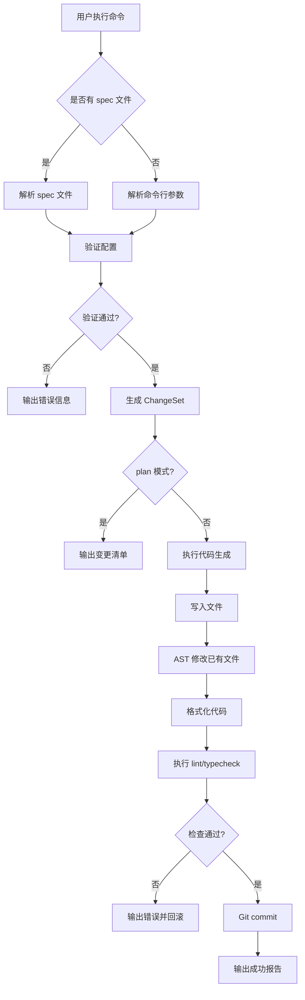

# Koatty AI 脚手架系统实施方案

## 一、项目概述

### 1.1 目标
基于 `koatty_cli` 开发智能化代码生成工具 `koatty-ai`，支持：
- **初期**：命令行参数驱动的代码生成（结构化输入）
- **远期**：LLM 自然语言理解与生成

### 1.2 核心价值
- 降低 Koatty 项目开发门槛
- 统一代码风格与最佳实践
- 提升开发效率（CRUD 模块 5 分钟生成）
- 可回滚、可复现的代码生成

---

## 二、初期方案：命令行指令参数驱动

### 2.1 CLI 命令设计

```bash
# 1. 初始化项目（增强版）
koatty-ai init <project-name> [options]
  --preset <minimal|standard|enterprise>  # 预设模板
  --db <mysql|postgresql|mongodb>         # 数据库类型
  --orm <typeorm|prisma>                  # ORM 选择
  --auth                                   # 是否包含认证模块
  --docker                                 # 是否生成 Docker 配置

# 2. 生成模块（完整 CRUD）
koatty-ai generate:module <module-name> [options]
  --fields <field-definitions>            # 字段定义（JSON/YAML）
  --api <rest|graphql>                    # API 类型
  --auth [roles]                          # 是否需要鉴权及角色
  --soft-delete                           # 软删除支持
  --pagination                            # 分页支持
  --search <fields>                       # 搜索字段

# 3. 生成单个组件
koatty-ai generate:controller <name> [options]
koatty-ai generate:service <name> [options]
koatty-ai generate:model <name> --fields <definitions>
koatty-ai generate:dto <name> --fields <definitions>
koatty-ai generate:migration <name>

# 4. 预览与应用
koatty-ai plan --spec <spec-file>        # 预览变更清单
koatty-ai apply --spec <spec-file>       # 执行生成
koatty-ai rollback                       # 回滚上次变更

# 5. 数据库操作
koatty-ai db:migrate                     # 执行迁移
koatty-ai db:rollback                    # 回滚迁移
koatty-ai db:seed                        # 数据填充

# 6. 工具命令
koatty-ai validate                       # 验证项目结构
koatty-ai format                         # 格式化生成代码
koatty-ai docs                           # 生成 API 文档
```

### 2.2 字段定义格式

支持两种输入方式：

**方式一：内联 JSON**
```bash
koatty-ai generate:module user \
  --fields '{
    "username": {"type": "string", "unique": true, "required": true},
    "email": {"type": "string", "format": "email"},
    "passwordHash": {"type": "string", "private": true},
    "status": {"type": "enum", "values": ["active", "inactive"], "default": "active"},
    "createdAt": {"type": "datetime", "auto": true}
  }'
```

**方式二：YAML 配置文件**
```bash
koatty-ai generate:module user --config ./specs/user.yml
```

`specs/user.yml`:
```yaml
module: user
table: users
fields:
  id:
    type: number
    primary: true
    auto: true
  username:
    type: string
    length: 50
    unique: true
    required: true
  email:
    type: string
    format: email
    nullable: true
  passwordHash:
    type: string
    length: 255
    private: true
  status:
    type: enum
    values: [active, inactive, banned]
    default: active
  createdAt:
    type: datetime
    auto: true
  updatedAt:
    type: datetime
    auto: true

api:
  basePath: /users
  endpoints:
    - method: GET
      path: /
      action: list
      pagination: true
      search: [username, email]
    - method: POST
      path: /
      action: create
      auth: true
      roles: [admin]
    - method: GET
      path: /:id
      action: detail
    - method: PUT
      path: /:id
      action: update
      auth: true
    - method: DELETE
      path: /:id
      action: remove
      auth: true
      roles: [admin]

dto:
  create: [username, email, password]
  update: [email, password, status]
  query: [username, email, status, page, pageSize]

auth:
  enabled: true
  defaultRoles: [user]

features:
  softDelete: true
  pagination: true
  search: true
  audit: true
```

### 2.3 生成流程



---

## 三、系统架构设计

### 3.1 核心模块

```
koatty-ai/
├── src/
│   ├── cli/                    # CLI 入口
│   │   ├── index.ts            # 主程序
│   │   ├── commands/           # 命令处理器
│   │   │   ├── init.ts
│   │   │   ├── generate.ts
│   │   │   ├── plan.ts
│   │   │   ├── apply.ts
│   │   │   └── rollback.ts
│   │   └── utils/              # CLI 工具函数
│   │
│   ├── parser/                 # 配置解析器
│   │   ├── SpecParser.ts       # Spec 文件解析
│   │   ├── FieldParser.ts      # 字段定义解析
│   │   └── Validator.ts        # 配置验证
│   │
│   ├── generators/             # 代码生成器（插件化）
│   │   ├── BaseGenerator.ts    # 生成器基类
│   │   ├── ProjectGenerator.ts # 项目初始化
│   │   ├── ModuleGenerator.ts  # 模块生成（组合调用）
│   │   ├── ModelGenerator.ts   # Model 生成
│   │   ├── DtoGenerator.ts     # DTO 生成
│   │   ├── ServiceGenerator.ts # Service 生成
│   │   ├── ControllerGenerator.ts
│   │   ├── MigrationGenerator.ts
│   │   ├── TestGenerator.ts
│   │   └── DocGenerator.ts
│   │
│   ├── templates/              # 代码模板（Handlebars）
│   │   ├── model/
│   │   ├── dto/
│   │   ├── service/
│   │   ├── controller/
│   │   ├── migration/
│   │   └── test/
│   │
│   ├── patcher/                # AST 代码修改器
│   │   ├── AstPatcher.ts       # 基于 ts-morph
│   │   ├── ModuleRegistrar.ts  # 模块注册
│   │   └── RouteRegistrar.ts   # 路由注册
│   │
│   ├── runner/                 # 执行器
│   │   ├── CommandRunner.ts    # 执行外部命令
│   │   ├── Validator.ts        # lint/build/test
│   │   └── MigrationRunner.ts  # 数据库迁移
│   │
│   ├── changeset/              # 变更管理
│   │   ├── ChangeSet.ts        # 变更集合
│   │   ├── FileChange.ts       # 文件变更
│   │   └── RollbackManager.ts  # 回滚管理
│   │
│   └── presets/                # 项目预设
│       ├── minimal/
│       ├── standard/
│       └── enterprise/
│
├── templates/                  # Handlebars 模板文件
├── specs/                      # 示例 spec 文件
└── package.json
```

### 3.2 数据流

```
[用户输入] 
    ↓
[命令解析] → [参数验证]
    ↓
[Spec 生成/解析]
    ↓
[生成器选择] → [模板渲染]
    ↓
[ChangeSet 构建]
    ↓
[AST Patch（修改已有文件）]
    ↓
[文件写入]
    ↓
[格式化/校验]
    ↓
[Git 提交]
```

---

## 四、代码生成器详细设计

### 4.1 Generator 接口

```typescript
interface IGenerator {
  name: string;
  
  // 生成代码
  generate(spec: Spec, context: GeneratorContext): Promise<ChangeSet>;
  
  // 验证配置
  validate(spec: Spec): ValidationResult;
  
  // 获取依赖（其他需要先执行的生成器）
  getDependencies(): string[];
}

interface Spec {
  module: string;
  table?: string;
  fields: Field[];
  api?: ApiConfig;
  dto?: DtoConfig;
  auth?: AuthConfig;
  features?: FeatureConfig;
}

interface ChangeSet {
  files: FileChange[];
  commands: Command[];
  git: GitOptions;
}

interface FileChange {
  type: 'create' | 'modify' | 'delete';
  path: string;
  content?: string;
  patch?: AstPatch;
}
```

### 4.2 ModuleGenerator（核心生成器）

```typescript
class ModuleGenerator implements IGenerator {
  name = 'module';
  
  private generators = [
    new ModelGenerator(),
    new DtoGenerator(),
    new ServiceGenerator(),
    new ControllerGenerator(),
    new MigrationGenerator(),
  ];
  
  async generate(spec: Spec, context: GeneratorContext): Promise<ChangeSet> {
    const changeSet = new ChangeSet();
    
    // 1. 创建模块目录
    changeSet.addFile({
      type: 'create',
      path: `src/modules/${spec.module}/index.ts`,
      content: this.renderModuleIndex(spec),
    });
    
    // 2. 依次调用子生成器
    for (const generator of this.generators) {
      const subChangeSet = await generator.generate(spec, context);
      changeSet.merge(subChangeSet);
    }
    
    // 3. 注册模块（AST patch）
    changeSet.addPatch({
      type: 'modify',
      path: 'src/modules/index.ts',
      patch: this.patchModuleRegistry(spec),
    });
    
    return changeSet;
  }
}
```

### 4.3 模板示例（Controller）

`templates/controller/controller.hbs`:
```handlebars
import { Controller, Get, Post, Put, Delete, PathVariable, Body, Query } from 'koatty';
import { {{pascalCase module}}Service } from '../service/{{pascalCase module}}Service';
import { Create{{pascalCase module}}Dto, Update{{pascalCase module}}Dto, Query{{pascalCase module}}Dto } from '../dto/{{pascalCase module}}Dto';
{{#if auth.enabled}}
import { Auth, Roles } from '@/decorators/auth';
{{/if}}

@Controller('{{api.basePath}}')
export class {{pascalCase module}}Controller {
  constructor(private {{camelCase module}}Service: {{pascalCase module}}Service) {}

  {{#each api.endpoints}}
  @{{method}}('{{path}}')
  {{#if auth}}@Auth(){{/if}}
  {{#if roles}}@Roles({{json roles}}){{/if}}
  async {{action}}(
    {{#if (eq action 'detail')}}@PathVariable('id') id: number{{/if}}
    {{#if (eq action 'update')}}@PathVariable('id') id: number, @Body() dto: Update{{pascalCase ../module}}Dto{{/if}}
    {{#if (eq action 'create')}}@Body() dto: Create{{pascalCase ../module}}Dto{{/if}}
    {{#if (eq action 'remove')}}@PathVariable('id') id: number{{/if}}
    {{#if (eq action 'list')}}@Query() query: Query{{pascalCase ../module}}Dto{{/if}}
  ) {
    {{#if (eq action 'list')}}
    return await this.{{camelCase ../module}}Service.findAll(query);
    {{/if}}
    {{#if (eq action 'detail')}}
    return await this.{{camelCase ../module}}Service.findById(id);
    {{/if}}
    {{#if (eq action 'create')}}
    return await this.{{camelCase ../module}}Service.create(dto);
    {{/if}}
    {{#if (eq action 'update')}}
    return await this.{{camelCase ../module}}Service.update(id, dto);
    {{/if}}
    {{#if (eq action 'remove')}}
    return await this.{{camelCase ../module}}Service.{{#if ../features.softDelete}}softDelete{{else}}delete{{/if}}(id);
    {{/if}}
  }
  {{/each}}
}
```

---

## 五、AST 修改器设计

### 5.1 使用 ts-morph 进行可靠修改

```typescript
import { Project, SourceFile } from 'ts-morph';

class ModuleRegistrar {
  private project: Project;
  
  registerModule(moduleName: string, modulePath: string) {
    const file = this.project.getSourceFile('src/modules/index.ts');
    
    // 1. 添加 import
    file.addImportDeclaration({
      moduleSpecifier: `./${moduleName}`,
      namedImports: [`${pascalCase(moduleName)}Module`],
    });
    
    // 2. 找到 modules 数组
    const arrayExpr = file.getFirstDescendantByKind(SyntaxKind.ArrayLiteralExpression);
    
    // 3. 添加模块
    arrayExpr.addElement(`${pascalCase(moduleName)}Module`);
    
    // 4. 保存
    file.saveSync();
  }
}
```

### 5.2 幂等性保证

```typescript
class AstPatcher {
  // 检查是否已存在
  hasImport(file: SourceFile, moduleName: string): boolean {
    return file.getImportDeclarations()
      .some(imp => imp.getModuleSpecifierValue() === moduleName);
  }
  
  // 幂等添加
  addImportIfNotExists(file: SourceFile, config: ImportConfig) {
    if (!this.hasImport(file, config.moduleSpecifier)) {
      file.addImportDeclaration(config);
    }
  }
}
```

---

## 六、变更管理与回滚

### 6.1 ChangeSet 结构

```typescript
class ChangeSet {
  id: string;
  timestamp: Date;
  files: FileChange[];
  commands: Command[];
  gitCommit?: string;
  
  // 保存为 JSON
  save(path: string) {
    fs.writeFileSync(path, JSON.stringify(this, null, 2));
  }
  
  // 从 JSON 加载
  static load(path: string): ChangeSet {
    return JSON.parse(fs.readFileSync(path, 'utf-8'));
  }
}
```

### 6.2 回滚机制

```typescript
class RollbackManager {
  async rollback(changeSetId: string) {
    const changeSet = ChangeSet.load(`.koatty-ai/changesets/${changeSetId}.json`);
    
    // 使用 git revert
    if (changeSet.gitCommit) {
      await this.gitRevert(changeSet.gitCommit);
    } else {
      // 手动回滚文件
      for (const file of changeSet.files.reverse()) {
        if (file.type === 'create') {
          fs.unlinkSync(file.path);
        } else if (file.type === 'delete') {
          fs.writeFileSync(file.path, file.backup);
        } else if (file.type === 'modify') {
          fs.writeFileSync(file.path, file.backup);
        }
      }
    }
  }
}
```

---

## 七、预设（Presets）

### 7.1 标准预设

**minimal**（最小可运行）
- Koatty 核心
- 基础路由
- 简单错误处理

**standard**（推荐）
- minimal +
- ESLint/Prettier
- 统一响应格式
- 日志中间件
- 环境配置
- 单元测试框架

**enterprise**（企业级）
- standard +
- RBAC 认证授权
- OpenAPI 文档
- Docker/Docker-Compose
- CI/CD 配置
- 审计日志
- 健康检查

### 7.2 预设文件结构

```
presets/
  standard/
    template/
      src/
        config/
        middleware/
        utils/
      .eslintrc.js
      .prettierrc
      tsconfig.json
    config.json           # 预设配置
    post-install.sh       # 后处理脚本
```

---

## 八、验证与质量保证

### 8.1 自动验证流程

```typescript
class Validator {
  async validate(changeSet: ChangeSet): Promise<ValidationResult> {
    const results = [];
    
    // 1. TypeScript 类型检查
    results.push(await this.runCommand('npm run typecheck'));
    
    // 2. ESLint
    results.push(await this.runCommand('npm run lint'));
    
    // 3. Prettier
    results.push(await this.runCommand('npm run format:check'));
    
    // 4. 单元测试（可选）
    if (this.config.runTests) {
      results.push(await this.runCommand('npm test'));
    }
    
    return this.mergeResults(results);
  }
}
```

### 8.2 生成后处理

```bash
koatty-ai apply --spec user.yml --validate --commit
```

执行流程：
1. 生成代码
2. `prettier --write`
3. `eslint --fix`
4. `tsc --noEmit`
5. `npm test`（可选）
6. `git add . && git commit -m "feat(user): add user module"`

---

## 九、远期规划：LLM 集成

### 9.1 架构扩展

```
[用户自然语言输入]
    ↓
[LLM 理解] → [生成结构化 Spec]
    ↓
[用户确认/修改 Spec]
    ↓
[现有代码生成流程]
```

### 9.2 LLM 集成点

#### 9.2.1 需求理解（Planner）

```typescript
class LLMPlanner {
  async parseInput(userInput: string, context: ProjectContext): Promise<Spec> {
    const prompt = `
你是 Koatty 框架专家。用户描述了一个功能需求，请生成规范的 Spec（YAML 格式）。

当前项目信息：
- 已有模块：${context.modules}
- 数据库类型：${context.db}
- ORM：${context.orm}

用户需求：
${userInput}

请生成符合以下格式的 Spec：
[示例 Spec 模板]

输出纯 YAML，不要额外解释。
`;

    const response = await this.llm.complete(prompt);
    return YAML.parse(response);
  }
}
```

#### 9.2.2 RAG 增强（Koatty 文档检索）

```typescript
class KoattyRAG {
  private vectorStore: VectorStore;
  
  async retrieveRelevantDocs(query: string): Promise<Document[]> {
    // 1. 嵌入查询
    const embedding = await this.embeddings.embed(query);
    
    // 2. 向量检索
    const docs = await this.vectorStore.similaritySearch(embedding, 5);
    
    return docs;
  }
  
  async enhancePrompt(userInput: string): Promise<string> {
    const docs = await this.retrieveRelevantDocs(userInput);
    
    return `
参考以下 Koatty 官方文档：
${docs.map(d => d.content).join('\n---\n')}

用户需求：
${userInput}

请基于 Koatty 最佳实践生成 Spec。
`;
  }
}
```

#### 9.2.3 代码生成增强

```typescript
class LLMCodeEnhancer {
  async refineCode(generatedCode: string, spec: Spec): Promise<string> {
    // 让 LLM 优化生成的代码（添加注释、错误处理等）
    const prompt = `
以下是基于模板生成的代码，请优化：
1. 添加完善的 JSDoc 注释
2. 增强错误处理
3. 添加必要的参数校验
4. 确保符合 Koatty 最佳实践

代码：
${generatedCode}

Spec：
${YAML.stringify(spec)}
`;

    return await this.llm.complete(prompt);
  }
}
```

### 9.3 交互式澄清

```typescript
class InteractivePlanner {
  async clarifyRequirements(userInput: string): Promise<Spec> {
    let spec = await this.llm.generateInitialSpec(userInput);
    
    // LLM 识别需要澄清的问题
    const questions = await this.llm.generateQuestions(spec);
    
    // 交互式询问
    for (const question of questions) {
      const answer = await this.prompt(question);
      spec = await this.llm.refineSpec(spec, question, answer);
    }
    
    return spec;
  }
}
```

### 9.4 LLM Provider 抽象

```typescript
interface ILLMProvider {
  complete(prompt: string, options?: CompletionOptions): Promise<string>;
  embed(text: string): Promise<number[]>;
}

class OpenAIProvider implements ILLMProvider {
  // OpenAI 实现
}

class QwenProvider implements ILLMProvider {
  // 通义千问实现
}

class LocalProvider implements ILLMProvider {
  // 本地模型（Ollama）实现
}
```

---

## 十、实施路线图

### Phase 1: MVP（1-2 个月）

**目标：命令行参数驱动的基础代码生成**

- [ ] CLI 框架搭建（Commander.js）
- [ ] Spec 文件格式定义与解析
- [ ] 核心生成器实现
  - [ ] ModelGenerator
  - [ ] DtoGenerator
  - [ ] ServiceGenerator
  - [ ] ControllerGenerator
  - [ ] MigrationGenerator
- [ ] 代码模板（Handlebars）
- [ ] AST Patcher（ts-morph）
- [ ] 单一预设（standard）
- [ ] 基础验证（lint + typecheck）
- [ ] 变更管理（ChangeSet + Git）
- [ ] 完整示例：用户管理模块

**交付物：**
- `koatty-ai` CLI 工具
- 完整的用户管理模块示例
- 文档：命令使用指南

### Phase 2: 增强功能（2-3 个月）

- [ ] 多数据库/ORM 支持
- [ ] 更多预设（minimal/enterprise）
- [ ] TestGenerator（单元测试生成）
- [ ] DocGenerator（OpenAPI）
- [ ] RBAC 模块生成
- [ ] 回滚功能完善
- [ ] 交互式配置向导
- [ ] 增量更新（修改已有模块）

**交付物：**
- 企业级预设
- 完整的认证授权模块示例

### Phase 3: LLM 智能化（3-4 个月）

- [ ] LLM Provider 接口设计
- [ ] OpenAI/通义千问集成
- [ ] Koatty 文档 RAG
  - [ ] 文档爬取与分块
  - [ ] 向量化与检索
- [ ] 自然语言 → Spec 转换
- [ ] 交互式需求澄清
- [ ] 代码优化与注释生成
- [ ] 多轮对话管理

**交付物：**
- 自然语言驱动的代码生成
- RAG 知识库

### Phase 4: 高级特性（长期）

- [ ] 反向工程（现有代码 → Spec）
- [ ] 代码重构建议
- [ ] GitHub Copilot 风格的实时建议
- [ ] 可视化配置界面（Web UI）
- [ ] 团队协作（Spec 共享与复用）
- [ ] 性能优化建议
- [ ] 安全扫描与修复

---

## 十一、技术选型

### 11.1 初期（命令行驱动）

| 组件 | 技术选型 | 理由 |
|------|---------|------|
| CLI 框架 | Commander.js | 成熟、易用 |
| 模板引擎 | Handlebars | 简单、可扩展 |
| AST 工具 | ts-morph | TypeScript 友好 |
| 配置格式 | YAML + JSON | 可读性 + 数据互通 |
| 代码格式化 | Prettier | 标准 |
| 版本控制 | simple-git | Git 操作 |

### 11.2 远期（LLM 集成）

| 组件 | 技术选型 | 理由 |
|------|---------|------|
| LLM Provider | OpenAI API / 通义千问 | 生产可用 |
| 向量数据库 | Chroma / Qdrant | 轻量、易部署 |
| 嵌入模型 | text-embedding-ada-002 / BGE | 质量 + 成本 |
| 提示工程 | LangChain.js | 链式调用 |

---

## 十二、质量保证

### 12.1 测试策略

```
tests/
  unit/                  # 单元测试
    generators/
    parsers/
  integration/           # 集成测试
    generate-module.test.ts
  e2e/                   # 端到端测试
    full-workflow.test.ts
  fixtures/              # 测试数据
    specs/
    expected-output/
```

### 12.2 CI/CD

```yaml
# .github/workflows/ci.yml
name: CI
on: [push, pull_request]

jobs:
  test:
    runs-on: ubuntu-latest
    steps:
      - uses: actions/checkout@v3
      - uses: actions/setup-node@v3
      - run: npm ci
      - run: npm test
      - run: npm run lint
      - run: npm run build
      
  e2e:
    runs-on: ubuntu-latest
    steps:
      - uses: actions/checkout@v3
      - run: npm ci
      - run: npm run test:e2e
```

---

## 十三、成功标准

### 13.1 MVP 验收标准

1. **功能完整性**
   - ✅ 能生成完整的 CRUD 模块（5 个文件 + migration）
   - ✅ 生成的代码通过 lint + typecheck
   - ✅ 生成的代码可直接运行

2. **易用性**
   - ✅ 单条命令完成模块生成（≤ 30 秒）
   - ✅ 错误提示清晰
   - ✅ 提供完整示例与文档

3. **可维护性**
   - ✅ 代码覆盖率 ≥ 80%
   - ✅ 支持回滚
   - ✅ 幂等执行

### 13.2 LLM 版本验收标准

1. **准确性**
   - ✅ 自然语言 → Spec 准确率 ≥ 85%
   - ✅ 生成的代码符合 Koatty 规范

2. **智能性**
   - ✅ 能识别并澄清歧义需求
   - ✅ 能基于项目上下文生成一致代码

---

## 十四、风险与应对

| 风险 | 影响 | 应对策略 |
|------|------|---------|
| 生成代码质量不稳定 | 高 | 充分测试 + 模板优化 + 代码审查 |
| AST 修改导致语法错误 | 中 | 事务性写入 + 自动回滚 |
| LLM 成本过高 | 中 | 本地模型备选 + 缓存 |
| Koatty 框架更新 | 低 | 定期同步文档 + 版本兼容 |

---

## 附录

### A. 完整示例：生成用户模块

```bash
# 1. 使用内联参数
koatty-ai generate:module user \
  --fields '{"username":{"type":"string","unique":true},"email":{"type":"string"},"passwordHash":{"type":"string","private":true}}' \
  --api rest \
  --auth admin \
  --soft-delete \
  --pagination

# 2. 使用配置文件
koatty-ai generate:module user --config specs/user.yml

# 3. 预览变更
koatty-ai plan --spec specs/user.yml

# 4. 执行生成
koatty-ai apply --spec specs/user.yml --validate --commit
```

### B. 参考资料

- [Koatty 官方文档](https://koatty.org)
- [Commander.js 文档](https://github.com/tj/commander.js)
- [ts-morph 文档](https://ts-morph.com/)
- [Handlebars 文档](https://handlebarsjs.com/)
